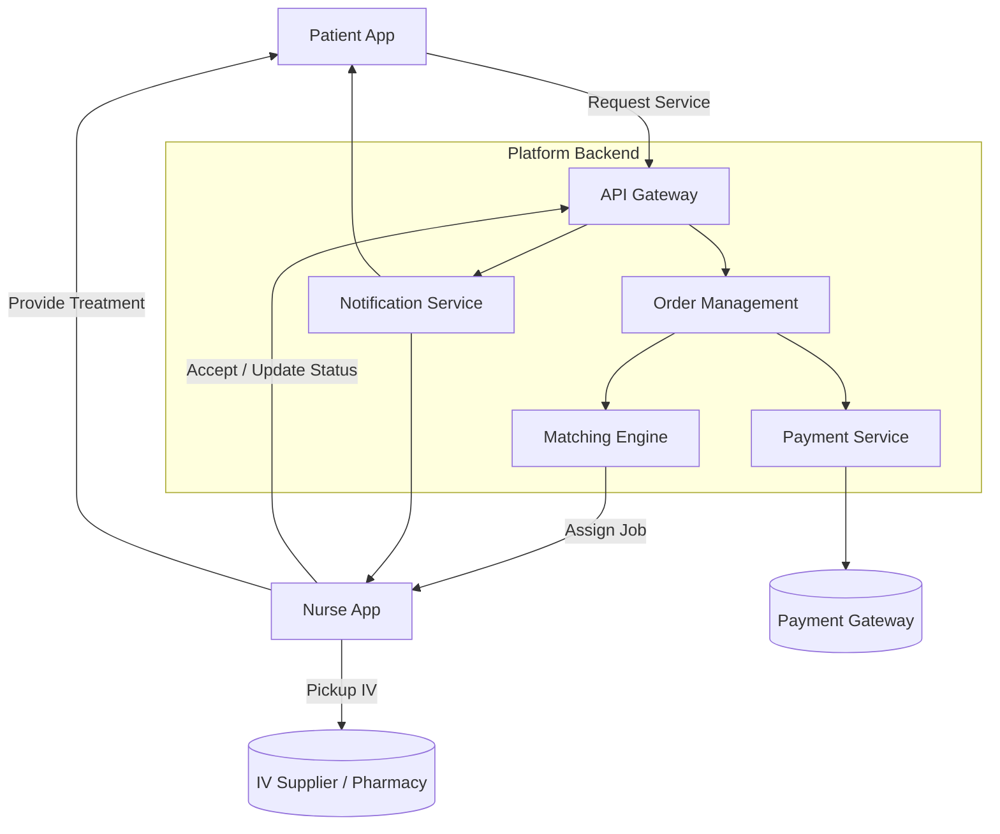
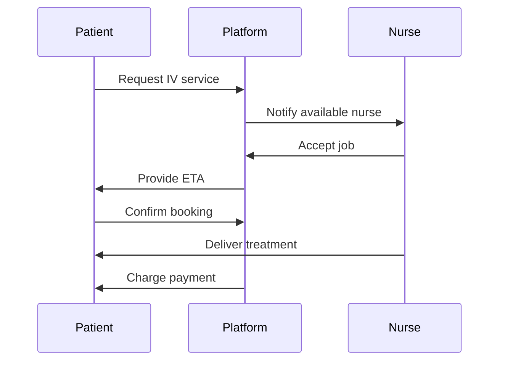
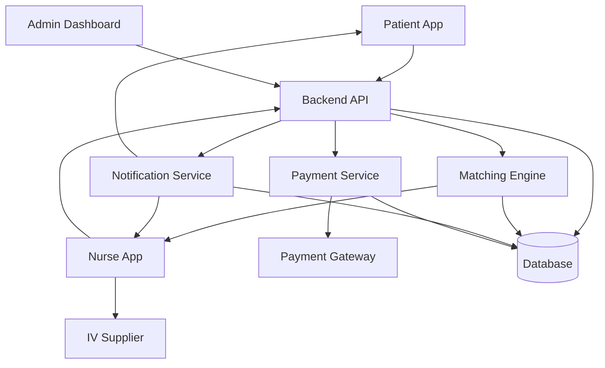
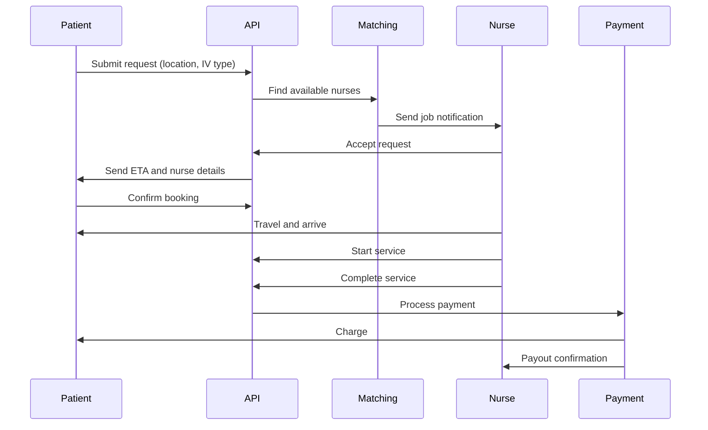
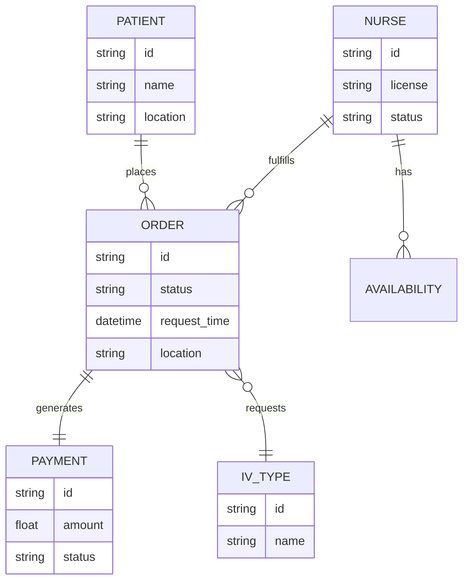
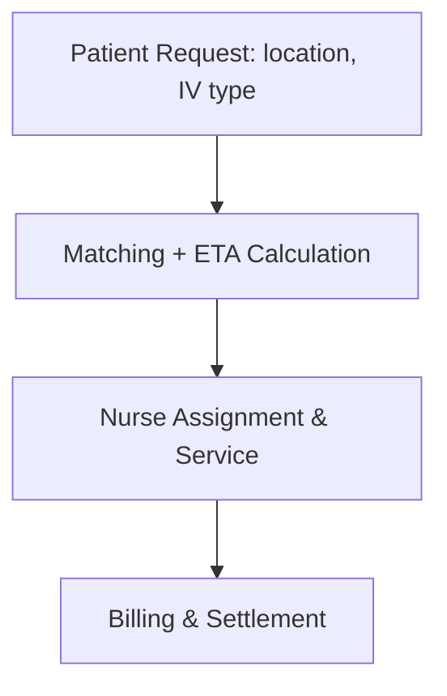

# IV Infusion On-Demand Platform  
## System Design Overview

---

# 1. Concept

A digital platform that connects patients with licensed nurses to deliver IV infusion services at home.

Core capabilities:
- On-demand service request  
- Real-time nurse matching  
- Service tracking  
- Payment processing  

---

# 2. High-Level Architecture

---

# 3. High-Level Service Flow

Description:

1. Patient submits a request for IV service  
2. Platform identifies available nurses  
3. Nurse receives notification and accepts  
4. Platform provides ETA to patient  
5. Nurse delivers treatment  
6. Patient is charged  

---

# 4. Expanded Architecture (Detailed)

Main components:

## Frontend
- Patient application (mobile/web)  
- Nurse application  
- Admin dashboard  

## Backend Services
- API layer  
- Matching engine  
- Notification service  
- Payment service  

## External Systems
- Payment gateway  
- IV supplier / pharmacy  

## Data Layer
- Central database  
- Logging and monitoring  

---

# 5. Detailed Service Flow

Expanded flow:

1. Patient submits request (location, IV type)  
2. Backend processes request  
3. Matching engine identifies suitable nurses  
4. Notifications sent to candidate nurses  
5. Nurse accepts request  
6. ETA calculated and sent to patient  
7. Patient confirms booking  
8. Nurse travels to patient  
9. Service begins and is tracked  
10. Service is completed  
11. Payment is processed  
12. Nurse payout is recorded  

---

# 6. Data Model

(Not necessarily at this stage)

Core entities:

- Patient  
- Nurse  
- Order (Service Request)  
- Payment  
- IV Type  
- Nurse Availability  

Relationships:

- Patient creates orders  
- Nurse fulfills orders  
- Order generates payment  
- Order references IV type  
- Nurse maintains availability  

---

# 7. Data Flow

Flow description:

1. Input:
   - Patient request (location, treatment type)  

2. Processing:
   - Matching algorithm  
   - ETA calculation  
   - Pricing logic  

3. Output:
   - Nurse assignment  
   - Notifications  
   - Payment execution  

---

# 8. System Boundaries

## Inside the Platform
- Patient and nurse applications  
- Backend services  
- Matching logic  
- Notifications  
- Payment orchestration  
- Data storage  

## Outside the Platform
- Medical regulation and compliance  
- Nurse certification and licensing  
- IV supply logistics  
- Insurance and liability coverage  

---

# 9. Additional System Concerns

## Reliability
- Real-time availability tracking  
- Retry mechanisms for failed notifications  
- Handling nurse cancellations and reassignment  

## Security & Privacy
- Protection of personal and medical data  
- Secure authentication and authorization  
- Encrypted communication  

## Scalability
- Horizontal scaling of backend services  
- Efficient matching algorithms  
- Handling peak demand  

## Latency
- Fast notification delivery  
- Low response time for matching  
- Accurate ETA calculations  

---

# 10. Business Logic Considerations

## Matching Strategy
- Nearest available nurse  
- Nurse specialization compatibility  
- Availability windows  

## Pricing Model
- Base service fee  
- Distance-based pricing  
- Time-based adjustments  

## Cancellation Handling
- Patient cancellation policies  
- Nurse cancellation penalties  
- Automatic reassignment logic  

---

# 11. Business Analytics & Metrics

## Demand Metrics
- Number of requests per day  
- Conversion rate (request → completed service)  
- Peak usage times  

## Supply Metrics
- Number of active nurses  
- Acceptance rate  
- Average response time  

## Operational Metrics
- Average ETA  
- Service duration  
- Cancellation rate  

## Financial Metrics
- Revenue per service  
- Cost per acquisition  
- Nurse payout ratios  
- Gross margin  

## Quality Metrics
- Patient ratings  
- Nurse ratings  
- Incident tracking  

---

# 12. Future Extensions

- Integration with medical record systems  
- AI-based triage before booking  
- Subscription plans for recurring treatments  
- Dynamic pricing models  
- Predictive demand and nurse positioning  

---