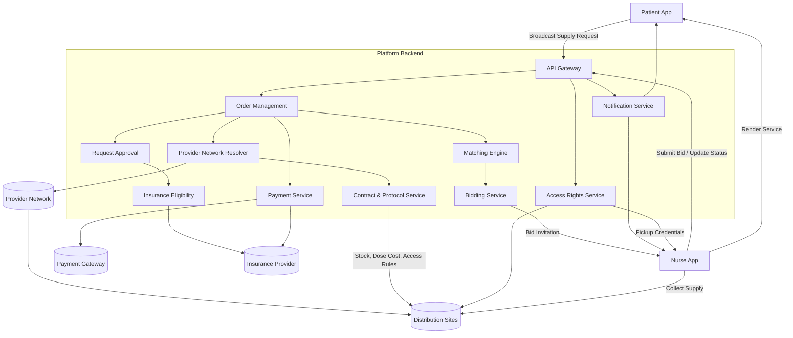
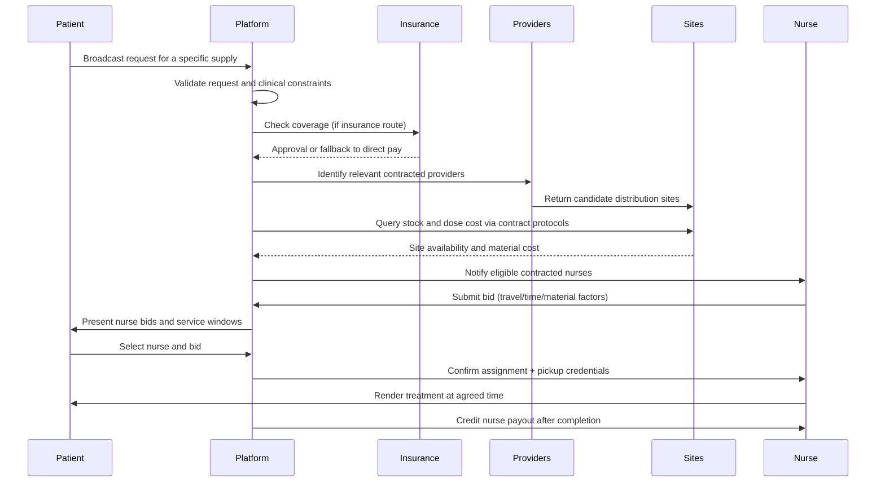
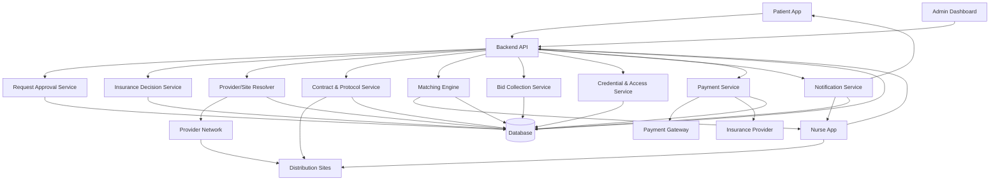
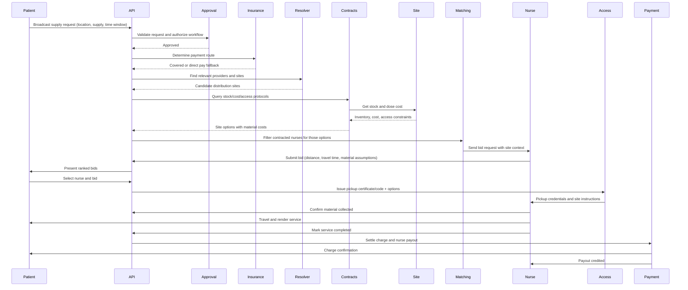
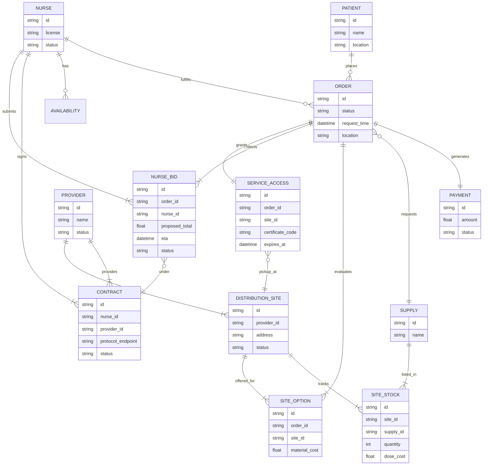
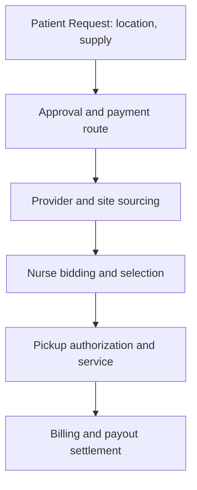

# IV Infusion On-Demand Platform  
## System Design Overview

---

# 1. Concept

A digital platform that connects patients with certified nurses to deliver supply-based infusion and treatment services at home through a contracted provider network.

Core capabilities:
- On-demand service request for a specific supply
- Contract-aware provider and distribution-site discovery
- Site-level stock and dose-cost query through provider protocols
- Nurse bidding based on travel/time/material economics
- Service tracking, fulfillment authorization, and payment settlement

---

# 2. High-Level Architecture

```mermaid
flowchart TD

    %% Frontend
    Patient[Patient App]
    Nurse[Nurse App]

    %% Backend Core
    subgraph Platform Backend
        API[API Gateway]
        Approval[Request Approval]
        Coverage[Insurance Eligibility]
        Match[Matching Engine]
        SupplyNet[Provider Network Resolver]
        ContractSvc[Contract & Protocol Service]
        Bids[Bidding Service]
        Notify[Notification Service]
        Order[Order Management]
        Access[Access Rights Service]
        PaymentSvc[Payment Service]
    end

    %% External Systems
    Payment[(Payment Gateway)]
    Insurance[(Insurance Provider)]
    Provider[(Provider Network)]
    DistSite[(Distribution Sites)]

    %% Flows
    Patient -->|Broadcast Supply Request| API
    API --> Order
    Order --> Approval
    Approval --> Coverage
    Coverage --> Insurance
    Order --> SupplyNet
    SupplyNet --> Provider
    Provider --> DistSite
    SupplyNet --> ContractSvc
    ContractSvc -->|Stock, Dose Cost, Access Rules| DistSite
    Order --> Match
    Match --> Bids
    Bids -->|Bid Invitation| Nurse

    Nurse -->|Submit Bid / Update Status| API
    API --> Notify
    Notify --> Patient
    Notify --> Nurse

    API --> Access
    Access -->|Pickup Credentials| Nurse
    Access --> DistSite

    Order --> PaymentSvc
    PaymentSvc --> Payment
    PaymentSvc --> Insurance

    Nurse -->|Collect Supply| DistSite

    Nurse -->|Render Service| Patient
``` 
---

# 3. High-Level Service Flow

```mermaid
sequenceDiagram
    participant Patient
    participant Platform
    participant Insurance
    participant Providers
    participant Sites
    participant Nurse

    Patient->>Platform: Broadcast request for a specific supply
    Platform->>Platform: Validate request and clinical constraints
    Platform->>Insurance: Check coverage (if insurance route)
    Insurance-->>Platform: Approval or fallback to direct pay
    Platform->>Providers: Identify relevant contracted providers
    Providers->>Sites: Return candidate distribution sites
    Platform->>Sites: Query stock and dose cost via contract protocols
    Sites-->>Platform: Site availability and material cost
    Platform->>Nurse: Notify eligible contracted nurses
    Nurse->>Platform: Submit bid (travel/time/material factors)
    Platform->>Patient: Present nurse bids and service windows
    Patient->>Platform: Select nurse and bid
    Platform->>Nurse: Confirm assignment + pickup credentials
    Nurse->>Patient: Render treatment at agreed time
    Platform->>Nurse: Credit nurse payout after completion
```
Description:

1. Patient broadcasts a service request for a specific supply  
2. Platform approves request and establishes payment route (direct or insurance)  
3. Platform discovers contracted providers and relevant distribution sites  
4. Platform queries stock, dose cost, and access rights under each contract  
5. Eligible contracted nurses are invited to submit bids  
6. Patient selects a nurse and a bid with committed service time  
7. Nurse receives pickup access artifacts (certificate/code) and collection options  
8. Nurse renders treatment and payout is settled on completion  

---

# 4. Expanded Architecture (Detailed)

```mermaid
    flowchart TD

    %% Frontend
    PatientApp[Patient App]
    NurseApp[Nurse App]
    AdminApp[Admin Dashboard]

    %% Core Backend
    API[Backend API]
    Match[Matching Engine]
    Notify[Notification Service]
    PaymentService[Payment Service]

    %% Domain Services
    ApprovalService[Request Approval Service]
    InsuranceService[Insurance Decision Service]
    ContractService[Contract & Protocol Service]
    SupplyResolver[Provider/Site Resolver]
    BidService[Bid Collection Service]
    AccessService[Credential & Access Service]

    %% External Systems
    PaymentGateway[Payment Gateway]
    InsuranceProvider[Insurance Provider]
    ProviderNetwork[Provider Network]
    DistributionSites[Distribution Sites]

    %% Data Layer
    DB[(Database)]

    %% Connections
    PatientApp --> API
    NurseApp --> API
    AdminApp --> API

    API --> ApprovalService
    API --> InsuranceService
    API --> SupplyResolver
    API --> ContractService
    API --> Match
    API --> BidService
    API --> AccessService
    Match --> NurseApp

    API --> Notify
    Notify --> PatientApp
    Notify --> NurseApp

    API --> PaymentService
    PaymentService --> PaymentGateway
    PaymentService --> InsuranceProvider

    SupplyResolver --> ProviderNetwork
    ProviderNetwork --> DistributionSites
    ContractService --> DistributionSites

    NurseApp --> DistributionSites

    API --> DB
    Match --> DB
    Notify --> DB
    PaymentService --> DB
    ApprovalService --> DB
    InsuranceService --> DB
    ContractService --> DB
    SupplyResolver --> DB
    BidService --> DB
    AccessService --> DB
```

Main components:

## Frontend
- Patient application (mobile/web)  
- Nurse application  
- Admin dashboard  

## Backend Services
- API layer  
- Request approval and eligibility  
- Insurance decisioning  
- Matching engine  
- Contract and protocol service  
- Provider and site resolver  
- Bid collection and ranking  
- Credential/access rights service  
- Notification service  
- Payment service  

## External Systems
- Payment gateway  
- Insurance provider  
- Provider organizations and their distribution sites  

## Data Layer
- Central database  
- Logging and monitoring  

---

# 5. Detailed Service Flow

```mermaid
sequenceDiagram
    participant Patient
    participant API
    participant Approval
    participant Insurance
    participant Resolver
    participant Contracts
    participant Site
    participant Matching
    participant Nurse
    participant Access
    participant Payment

    Patient->>API: Broadcast supply request (location, supply, time window)
    API->>Approval: Validate request and authorize workflow
    Approval-->>API: Approved
    API->>Insurance: Determine payment route
    Insurance-->>API: Covered or direct pay fallback

    API->>Resolver: Find relevant providers and sites
    Resolver-->>API: Candidate distribution sites
    API->>Contracts: Query stock/cost/access protocols
    Contracts->>Site: Get stock and dose cost
    Site-->>Contracts: Inventory, cost, access constraints
    Contracts-->>API: Site options with material costs

    API->>Matching: Filter contracted nurses for those options
    Matching->>Nurse: Send bid request with site context
    Nurse->>API: Submit bid (distance, travel time, material assumptions)
    API->>Patient: Present ranked bids
    Patient->>API: Select nurse and bid

    API->>Access: Issue pickup certificate/code + options
    Access->>Nurse: Pickup credentials and site instructions

    Nurse->>API: Confirm material collected
    Nurse->>Patient: Travel and render service
    Nurse->>API: Mark service completed

    API->>Payment: Settle charge and nurse payout
    Payment->>Patient: Charge confirmation
    Payment->>Nurse: Payout credited
```

Expanded flow:

1. Patient broadcasts request for a specific supply and location  
2. Backend validates and approves request eligibility  
3. Payment route is established (insurance-covered or direct pay)  
4. Provider and distribution-site options are identified  
5. Contract protocols return site stock, dose cost, and access rights  
6. Eligible contracted nurses are invited to bid  
7. Nurses submit bids using travel time, distance, and material economics  
8. Patient selects nurse and bid with committed service time  
9. Nurse receives pickup credentials and collection instructions  
10. Nurse collects material and renders service  
11. Platform settles payment and credits nurse payout  

---

# 6. Data Model

(Not necessarily at this stage)

```mermaid
erDiagram

    PATIENT ||--o{ ORDER : places
    NURSE ||--o{ ORDER : fulfills
    ORDER ||--|| PAYMENT : generates
    NURSE ||--o{ AVAILABILITY : has
    ORDER }o--|| SUPPLY : requests
    NURSE ||--|{ CONTRACT : signs
    PROVIDER ||--|{ CONTRACT : provides
    PROVIDER ||--|{ DISTRIBUTION_SITE : owns
    DISTRIBUTION_SITE ||--|{ SITE_STOCK : tracks
    SUPPLY ||--|{ SITE_STOCK : listed_in
    ORDER ||--|{ SITE_OPTION : evaluates
    DISTRIBUTION_SITE ||--|{ SITE_OPTION : offered_for
    ORDER ||--|{ NURSE_BID : collects
    NURSE ||--|{ NURSE_BID : submits
    NURSE_BID }o--|| CONTRACT : under
    ORDER ||--|| SERVICE_ACCESS : grants
    SERVICE_ACCESS }o--|| DISTRIBUTION_SITE : pickup_at

    PATIENT {
      string id
      string name
      string location
    }

    NURSE {
      string id
      string license
      string status
    }

    ORDER {
      string id
      string status
      datetime request_time
      string location
    }

    PAYMENT {
      string id
      float amount
      string status
    }

    SUPPLY {
      string id
      string name
    }

    PROVIDER {
      string id
      string name
      string status
    }

    CONTRACT {
      string id
      string nurse_id
      string provider_id
      string protocol_endpoint
      string status
    }

    DISTRIBUTION_SITE {
      string id
      string provider_id
      string address
      string status
    }

    SITE_STOCK {
      string id
      string site_id
      string supply_id
      int quantity
      float dose_cost
    }

    SITE_OPTION {
      string id
      string order_id
      string site_id
      float material_cost
    }

    NURSE_BID {
      string id
      string order_id
      string nurse_id
      float proposed_total
      datetime eta
      string status
    }

    SERVICE_ACCESS {
      string id
      string order_id
      string site_id
      string certificate_code
      datetime expires_at
    }
```

Core entities:

- Patient  
- Nurse  
- Order (Service Request)  
- Payment  
- Supply  
- Nurse Availability  
- Contract  
- Provider  
- Distribution Site  
- Site Stock  
- Nurse Bid  
- Service Access Artifact  

Relationships:

- Patient creates orders  
- Nurse fulfills orders  
- Order generates payment  
- Order references supply  
- Nurse maintains availability  
- Nurse and provider are linked by one or more contracts  
- Provider owns one or more distribution sites  
- Site stock defines availability and dose cost by supply  
- Order receives many nurse bids and one selected bid drives assignment  
- Service access artifacts authorize pickup at the selected site  

---

# 7. Data Flow

```mermaid
flowchart TD
    Input[Patient Request: location, supply]
    Approval[Approval and payment route]
    Sourcing[Provider and site sourcing]
    Bidding[Nurse bidding and selection]
    Execution[Pickup authorization and service]
    Payment[Billing and payout settlement]

    Input --> Approval --> Sourcing --> Bidding --> Execution --> Payment
```

Flow description:

1. Input:
   - Patient request (location, supply type, preferred window)  

2. Processing:
   - Eligibility approval + insurance/direct-pay decision  
   - Contract protocol calls for stock/cost/access validation  
   - Site option generation and material cost aggregation  
   - Nurse bid intake, ranking, and patient selection  

3. Output:
   - Selected nurse and committed service window  
   - Pickup credentials/certificate for material collection  
   - Payment execution and nurse credit  

---

# 8. System Boundaries

## Inside the Platform
- Patient and nurse applications  
- Backend services  
- Matching logic  
- Notifications  
- Payment orchestration  
- Data storage  

## Outside the Platform
- Medical regulation and compliance  
- Nurse certification and licensing  
- IV supply logistics  
- Insurance and liability coverage  

---

# 9. Additional System Concerns

## Reliability
- Real-time availability tracking  
- Retry mechanisms for failed notifications  
- Handling nurse cancellations and reassignment  

## Security & Privacy
- Protection of personal and medical data  
- Secure authentication and authorization  
- Encrypted communication  

## Scalability
- Horizontal scaling of backend services  
- Efficient matching algorithms  
- Handling peak demand  

## Latency
- Fast notification delivery  
- Low response time for matching  
- Accurate ETA calculations  

---

# 10. Business Logic Considerations

## Matching Strategy
- Contracted nurse eligibility by provider/site
- Nurse certification compatibility for requested supply
- Distance/travel-time and availability windows
- Bid competitiveness and patient preference

## Pricing Model
- Base service fee  
- Site-level material dose cost
- Distance-based pricing  
- Time-based adjustments  
- Insurance coverage and co-pay adjustments

## Cancellation Handling
- Patient cancellation policies  
- Nurse cancellation penalties  
- Automatic reassignment logic  

---

# 11. Business Analytics & Metrics

## Demand Metrics
- Number of requests per day  
- Conversion rate (request → completed service)  
- Peak usage times  

## Supply Metrics
- Number of active nurses  
- Acceptance rate  
- Average response time  

## Operational Metrics
- Average ETA  
- Service duration  
- Cancellation rate  

## Financial Metrics
- Revenue per service  
- Cost per acquisition  
- Nurse payout ratios  
- Gross margin  

## Quality Metrics
- Patient ratings  
- Nurse ratings  
- Incident tracking  

---

# 12. Future Extensions

- Integration with medical record systems  
- AI-based triage before booking  
- Subscription plans for recurring treatments  
- Dynamic pricing models  
- Predictive demand and nurse positioning  

---